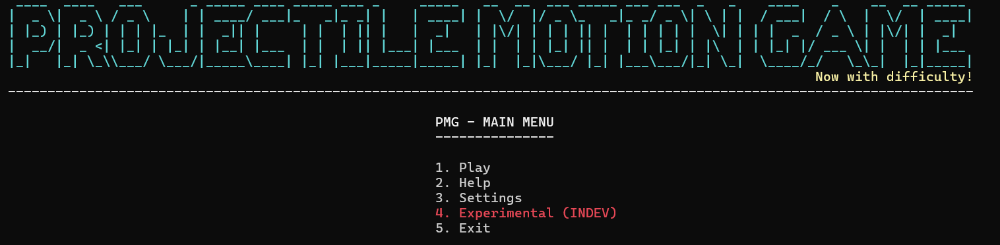
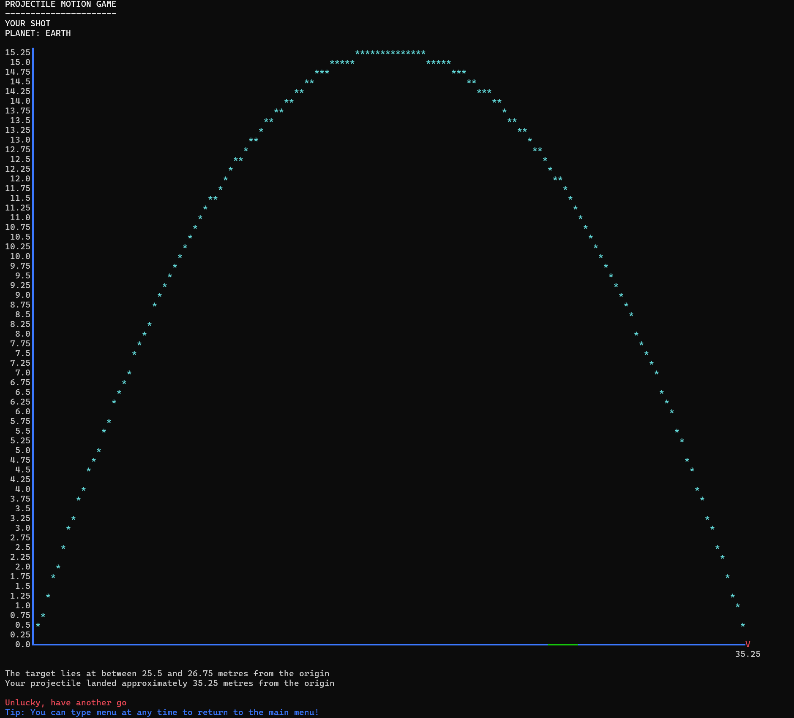

# Projectile Motion Game
This is a neat little terminal based game which drew upon my study of projectile motion in both Mathematics and Physics. It has custom random splash text, difficulties, and the ability to play with different planetary gravities!
The entire game was made almost entirely from scratch, only using a limited set of built in libraries (e.g. random and time).
The game features a custom made graphing calculator to display the parabolic trajectories of the projectiles, showing X intercepts, a complete Y scale, coloured axes, and the ability to display a range on the X axis for a target.



# How to Install and Test
The entire project is contained within the Python file. Simply download the file and run the code using ```python ISTgraphingCalculatorPMv8.1.py```
